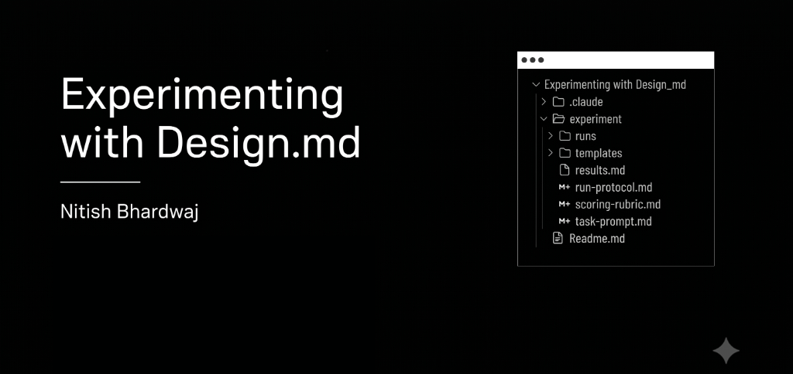

# What is `design.md`?

Few weeks back, I kept seeing tweets about `design.md` all over my feed.

*"You should ship a design.md with your design system."*

*"AI agents understand products much better if you have one."*

I didn't actually understand why. So I though build something to test it.

Note: Check this link for project files and detailed results.
---

## The question

If a project already has a mature design system, semantic tokens, reusable components, and good code, what exactly is left for a markdown file to do?

An AI agent can already see your design system, inspect every component.

It can open `Button.jsx`, see every available variant, inspect the spacing tokens, read the CSS variables, and understand the API of every component.

So what information is missing? Would an agent build something genuinely different with it versus without it?

---

# The Idea

My plan was simple: build a to-do list application, twice.

Version 1: Components + variables + a design.md file.

Version 2: Components + variables, and nothing else.

Both versions get the exact same coded component library and the same CSS variables. The only difference is that one folder has a design.md in it. Then, I give an AI agent the same prompt to both versions:

> Build a to-do application with add, delete, complete, filtering, priorities, confirmation before delete, and empty states.

No design instructions.

No screenshots.

No examples.

The only variable was the presence of `design.md`.

For detailed prompt, check task-prompt.md
---

## Making the experiment measurable

To measure the differences between both versions, I intentionally designed situations where the component library allowed multiple valid choices while the product only wanted one.

For example:

* The Button component supports a `danger` variant anywhere.
  My design only wants it inside confirmation dialogs.

* Badge supports five colors.
  My design only wants gray, amber and red for task priorities.

* Cards support flat and elevated variants.
  My design reserves elevation only for overlays.

From the component code alone, every option is technically correct.

Only `design.md` explains which choice represents the product's design language.

These gaps became the measurement instrument.

---

## The run protocol

To reduce randomness, I ran six completely isolated agents.

* Three runs with `design.md`
* Three runs without it

Each run started in a fresh session.

Each agent only saw its own version of the project.

Each received the exact same frozen prompt.

After every build finished, I scored the outputs using a rubric I wrote before running the experiment.

The rubric looked at:

* component reuse
* token discipline
* composition
* state handling
* intended design decisions
* consistency across runs
and more

Check scoring-rubric.md for more details.

The agents never saw this rubric.

---

# The results

The numbers surprised me.

**Version 1 (with `design.md`)**

**27 / 27**

**100%**

**Version 2 (without)**

**16 / 27**

**59%**

But the interesting part wasn't the score.

It was *where* the failures happened.

Every agent run without design.md independently chose the same conventions:

* green badge for low priority
* destructive delete buttons on every row
* inline confirmation instead of a dialog
* white page background
* new tasks appended to the bottom

They're simply common conventions the models have learned from thousands of existing interfaces.

All three agents run with design.md, read it, and produced nearly identical applications.

Same layout.

Same dialog structure.

Same component variants.

Almost identical wording.

The biggest difference wasn't quality.

It was consistency.

For details results check results.md
---

# Experiment Conclusion

The experiment changed how I think about design documentation.

## 1. `design.md` matters exactly where convention and intent diverge.

When industry convention already matched my design, the document added almost nothing.

All agents correctly used muted completed tasks.

All used the EmptyState component.

All respected the existing design tokens.

They didn't need documentation because those choices were already obvious.

Documentation became valuable only where my product intentionally broke from convention.

---

## 2. The biggest benefit is reproducibility.

The agent runs with design.md produced almost identical outputs across all three runs.

The designs without design.md weren't bad. The problem was that every run represented a slightly different product.

---

## 3. Agents never leave blanks.

Whenever the design system had a hole, every agent invented something.

For Example:

There was no Priority Select component. Every run quietly built one.

There was no Dialog component. The agents with design.md followed the recipe described in `design.md`. The agents without design.md invented inline confirmation instead.

There were no icons. Some agents drew SVG trash cans. Others used simple glyphs.

Agents don't stop when something is missing. They fill the gap.

---

# The real takeaway

Before running this experiment, I thought `design.md` was documentation.

Now I think it's something else.

It's the place where design intent lives.

Components describe capability.

Tokens describe consistency.

`design.md` describes judgment.

It's where you explain the decisions that cannot be inferred from code.

And there's another lesson that only became obvious after seeing the results.

Every mistake an agent makes is feedback for the specification itself.

If the agent consistently misunderstands something, that's usually not an AI problem. It's a missing design rule.

Update the document.

Run it again.

Repeat.

Eventually, the document stops being something you wrote from memory and becomes something shaped by actual evidence.
