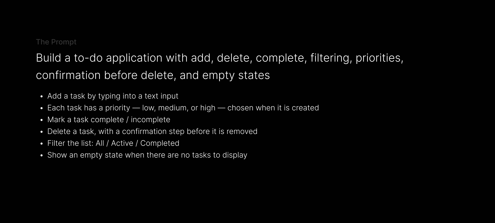
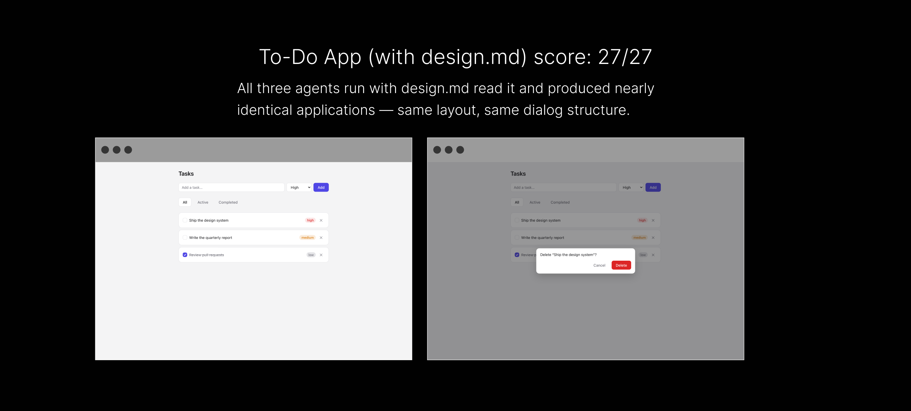
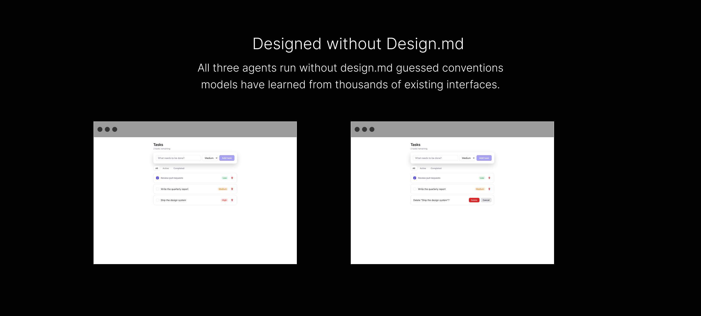

# Experimenting with Design.md

A few weeks back, I kept seeing tweets about Design.md all over my feed.

> *"You should ship a Design.md with your design system."*
>
> *"AI agents understand products much better if you have one."*

I didn't actually understand why — so I thought I'd build something to test it.

 

### The Question

> *If a project already has a mature design system — semantic tokens, reusable components, good code — what exactly is left for a markdown file to do?*

An AI agent can already see your design system and inspect every component. It can open `Button.jsx`, see every available variant, read the spacing tokens, and understand the API of every component.

So what information is actually missing? Would an agent build something
genuinely different with `design.md` than without it?

 

### The Plan

The plan was simple: build a to-do list application, twice.

| | Contains |
|---|---|
| **To-Do (With Design.md)** | components + variables + a `design.md` file |
| **To-Do (Without Design.md)** | components + variables, and nothing else |

Both versions share the exact same coded component library and the same CSS
variables. The only difference is that one folder has a `design.md` in it. I then gave an AI agent the same prompt against both versions:

No design instructions. No screenshots. No examples. The only variable was the presence of `design.md`.

Full prompt: [`experiment/task-prompt.md`](experiment/task-prompt.md).

 

### Measuring the Experiment

To measure the difference between the two versions, I intentionally designed situations where the component library allowed multiple valid choices, while the product only wanted one — call them **intent gaps**. For example:

- The Button component supports a `danger` variant anywhere. My design only wants it inside confirmation dialogs.
- Badge supports five colors. My design only wants gray, amber, and red for task priorities.
- Cards support `flat` and `elevated` variants. My design reserves elevation only for overlays.

From the component code alone, every option is technically valid. Only
`design.md` explains which choice matches the product's actual design language and these gaps became the measurement instrument. 

Full list and scoring rubric:
[`experiment/scoring-rubric.md`](experiment/scoring-rubric.md).

 

### The Run Protocol

To reduce randomness, I ran six completely isolated agents:

- Three runs **with** `design.md`
- Three runs **without** it

Each run started in a fresh session, each agent only saw its own version of the project, and each received the exact same frozen prompt. The agents never saw the scoring rubric.

After every build finished, I scored the outputs against a rubric written
*before* running the experiment, covering:

- Component reuse
- Token discipline
- Composition
- State handling
- Correctness on the intent gaps
- Consistency across the three repeat runs

Full protocol: [`experiment/run-protocol.md`](experiment/run-protocol.md).

 

### The Results

But the interesting part wasn't the score — it was *where* the failures happened.

Every agent run without `design.md` independently converged on the same
conventions:

- Green badge for low priority
- Destructive (red) delete buttons on every row
- Inline confirmation instead of a dialog
- White page background
- New tasks appended to the bottom

These are simply the common conventions models have learned from thousands of existing interfaces. 

Meanwhile, all three agents run *with* `design.md` read it
and produced nearly identical applications — same layout, same dialog structure,
same component variants, almost identical wording.

The biggest difference wasn't quality. It was consistency.

Full breakdown: [`experiment/results.md`](experiment/results.md). Screenshots:
[`experiment/runs/screenshots/`](experiment/runs/screenshots).

 

### Conclusion

The experiment changed how I think about design documentation.

**1. `design.md` matters exactly where convention and intent diverge:** 

When industry convention already matched my design, the document added almost nothing — all agents correctly muted completed tasks, used the EmptyState component, and respected the existing tokens, with or without the doc. They didn't need documentation because those choices were already obvious. Documentation became valuable only where my product intentionally broke from convention.

 

**2. The biggest benefit is reproducibility, not quality:** 

The `design.md` runs produced almost identical outputs across all three repeats. The runs without it weren't *bad* — the problem was that every run represented a slightly different product.

 

**3. Agents never leave blanks:** 

Whenever the design system had a hole, every agent invented something to fill it:

- There was no Priority Select component — every run quietly built one, the same way.
- There was no Dialog component — agents with `design.md` followed the recipe it
  described; agents without it invented an inline confirmation instead.
- There were no icons — some agents drew SVG trash cans, others used plain glyphs.

Agents don't stop when something is missing. They fill the gap — with your
intent if you wrote it down, with the internet's average intent if you didn't.

 

### The Takeaway

Before running this experiment, I thought `design.md` was documentation. Now I
think it's something else.

It's the place where design intent lives. Components describe capability. Tokens
describe consistency. `design.md` describes judgment — it's where you explain the
decisions that cannot be inferred from code.

There's a second lesson that only became obvious after seeing the results: every
mistake an agent makes is feedback for the specification itself. If an agent
consistently misunderstands something, that's usually not an AI problem — it's a
missing design rule. Update the document, run it again, repeat. Eventually, the
document stops being something you wrote from memory and becomes something shaped
by actual evidence.
